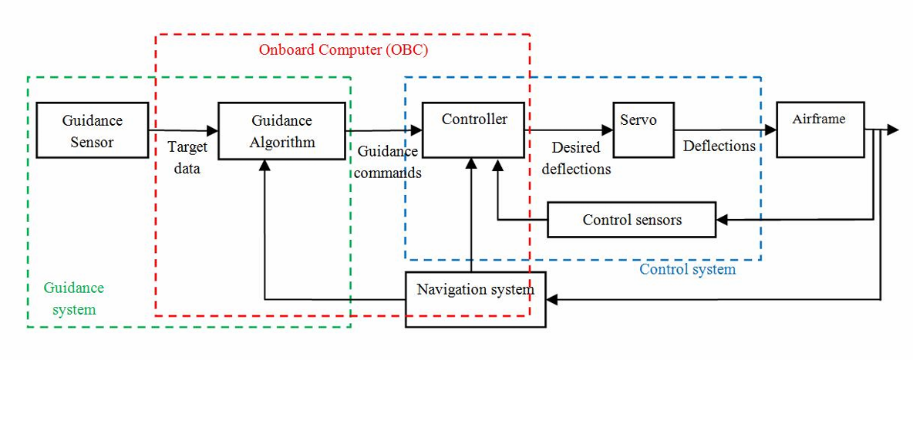

# 3DoF Flight Dynamics Engine

A nonlinear longitudinal aircraft flight dynamics simulator written in Python.

This project implements a physics-based three-degree-of-freedom (3DoF) aircraft model with aerodynamic force and moments, flight control systems, trimming utilities, disturbance injection, ground-gear interaction, and visualization tools.

The primary goal of this project is educational: it helped me understand flight dynamics and control systems and provides a transparent and extensible flight simulation framework that bridges the gap between textbook flight dynamics and practical numerical simulation.

---

## Features

### Aircraft Dynamics

* Nonlinear longitudinal aircraft dynamics
* Aerodynamic lift, drag, and pitching moment modeling
* Angle-of-attack dependent aerodynamics

### Numerical Simulation

* Fixed-step simulation
* Fourth-order Runge-Kutta (RK4) integration
* State logging and data collection

### Flight Control and guidance

* Modular flight control architecture
* Flight modes
* Implemnted conventional controllers (PD, PID, ...)
* Actuator saturation support
* Guidance laws

### Environment and Disturbances

* External disturbance injection
* Ground interaction model
* Spring-damper landing gear

### Analysis and Visualization

* Standard avionics-style plots
* Custom plotting utilities
* Time-history visualization



### *for more details, read the [technical_reference](/docs/techincal_reference.md)

---

## Project Structure

```text
3dof-flight-dynamics/

├── README.md
├── LICENSE
├── requirements.txt

├── src/
│   └── flight3dof/
│       ├── dynamics.py
│       ├── simulator.py
│       ├── controls.py
│       ├── plotting.py
│       └── utils.py

├── examples/
│   ├── t0_free_fall_no_aero.py
│   ├── t1_free_fall_with_aero.py
│   ├── t2_trimmed_level_flight.py
│   ├── t3_trimmed_climb.py
│   ├── t4_pitch_control.py
│   ├── t5_runway_standing.py
│   └── t6_takeoff.py

├── docs/
│   ├── technical_reference.md
│   └── images/
│
└── results/
```

---

## State Definition

The aircraft state vector is

```math
X =
\begin{bmatrix}
x_I \\
z_I \\
\theta \\
u \\
w \\
q
\end{bmatrix}
```

where

| Variable | Description                  |
| -------- | ---------------------------- |
| x_I      | Inertial horizontal position |
| z_I      | Inertial vertical position   |
| θ        | Pitch attitude               |
| u        | x body velocity              |
| w        | z body velocity              |
| q        | Pitch rate                   |


---

## Control Inputs

```math
U =
\begin{bmatrix}
\delta_t \\
\delta_e
\end{bmatrix}
```

| Variable | Description         |
| -------- | ------------------- |
| δ_t      | Throttle command    |
| δ_e      | Elevator deflection |


---
## Example Scenarios

### T0 – Ballistic Free Fall

No aerodynamic forces.


---

### T1 – Aerodynamic Free Fall

Lift and drag effects enabled.


---

### T2 – Trimmed Level Flight

Steady-state flight without active control.


---

### T3 – Trimmed Climb

Steady climbing flight condition.


---

### T4 – Disturbance Rejection

Comparison between uncontrolled aircraft and PD-controlled pitch stabilization.


---

### T5 – Ground Interaction

Aircraft standing on runway with spring-damper landing gear model.


---

### T6 – Takeoff

Ground roll, rotation, and initial climb.


---


## Future Work

* Wind model
* Atmospheric density variation
* Sensor models
* State estimation
* Autopilot modes
* Navigation systems
* 6DoF extension
* Aircraft configuration files
* Linearization tools
* Frequency-domain analysis

---

## Motivation

Flight dynamics is often taught through linearized equations and isolated examples. While these methods are essential, they can obscure the interconnected nature of aircraft motion.

This project was developed as an attempt to build a simulation framework from first principles, combining aerodynamics, rigid-body mechanics, numerical integration, and feedback control into a single coherent environment.

The result is not intended to compete with professional flight simulators. Instead, it aims to be a transparent engineering tool where every force, moment, state, and assumption can be inspected, modified, and understood.
