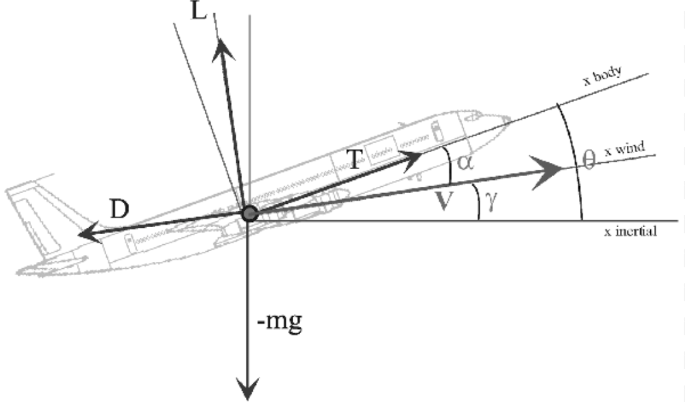

# Technical Reference

## Introduction

This document describes the mathematical formulation, assumptions, and physical models implemented within the 3DoF Flight Dynamics Engine.

The simulator models the longitudinal motion of a rigid fixed-wing aircraft and is intended for educational, research, and control-system development purposes.

The philosophy of the project is simplicity without sacrificing physical meaning. Every equation implemented in the simulator can be traced directly to classical flight dynamics and rigid-body mechanics.

---

# Degrees of Freedom

The model contains three dynamic degrees of freedom:

1. Horizontal translation
2. Vertical translation
3. Pitch rotation

The aircraft is therefore treated as a longitudinal rigid body.

The following motions are neglected:

* Roll
* Yaw
* Lateral translation
* Sideslip effects
* Asymmetric aerodynamics

---

# Reference Frames

Two coordinate systems are used.

## Inertial Frame

The inertial frame is defined by

```text
x_I : horizontal
z_I : vertical upward
```

Aircraft position is expressed in this frame.

---

## Body Frame

The body frame is attached to the aircraft.

```text
x : nose direction
z : downward through fuselage
y : right wing
```

Aerodynamic and propulsive forces are ultimately resolved into this frame before equations of motion are evaluated.


---

# State Vector

The system state is

```math
X =
[x_I,\ z_I,\ \theta,\ u,\ w,\ q]^T
```

where

* x_I : horizontal position
* z_I : altitude
* θ : pitch attitude
* u : forward velocity
* w : vertical body velocity
* q : pitch rate

---

# Control Inputs

The system input vector is

```math
U =
[\delta_t,\ \delta_e]^T
```

where

* δ_t : throttle command
* δ_e : elevator deflection

---

# Aerodynamic Model (in stability frame of reference)


## Angle of Attack

Angle of attack is defined as

```math
\alpha = \tan^{-1}\left(\frac{w}{u}\right)
```

---

## True Airspeed

```math
V = \sqrt{u^2+w^2}
```

---

# Lift Model

Lift coefficient

```math
C_L = C_{L0}+C_{L\alpha}\alpha
```

Lift force

```math
L =
\frac{1}{2}\rho V^2 S C_L
```

---

# Drag Model

The drag model follows a classical parabolic approximation.

```math
C_D = C_{D0}+kC_L^2
```

Drag force

```math
D =
\frac{1}{2}\rho V^2 S C_D
```
---

## Aerodynamic Parameters
Wing Area $S$

$S$ is the planform wing area (m²), representing the effective surface exposed to airflow and governing lift and drag magnitude.

## Mean Aerodynamic Chord $c$

$c$ is the mean aerodynamic chord (MAC), a representative chord length of the wing.

The aerodynamic center is assumed fixed at:

$$
x_{ac} = 0.25c
$$

Center of gravity location:

$$
x_{cg} = cg \cdot c
$$

Moment arm:

$$
(x_{cg} - x_{ac}) = (cg - 0.25)c
$$

---

# Pitching Moment Model

Pitching moment coefficient

```math
C_m
=
C_{m0}
+
C_{m\alpha}\alpha
+
C_{m\delta_e}\delta_e
```

The model includes dynamic damping terms.

```math
M_q
\propto
C_{mq}q
```

and

```math
M_{\dot\alpha}
\propto
C_{m\dot\alpha}\dot\alpha
```

The resulting aerodynamic pitching moment is

```math
M_s
=
\frac12\rho V^2ScC_m
+
\frac14\rho VSc^2
\left(
C_{mq}q
+
C_{m\dot\alpha}\dot\alpha
\right)
```
---

# Gravity Model

Gravity is modeled as a constant acceleration

```math
g = 9.81\ m/s^2
```

directed downward in the inertial frame.

No variation with altitude is considered.

---

# Propulsion Model

The propulsion model is intentionally simple.

Maximum thrust

```math
T_{max}
```

is scaled linearly by throttle command

```math
0 \le \delta_t \le 1
```

resulting in

```math
T = T_{max}\delta_t
```

The thrust vector is assumed aligned with the body x-axis.

The following effects are neglected:

* Propeller slipstream
* Thrust vectoring
* Engine dynamics
* Spool-up delays

---

# Translational Dynamics

Body-axis force equations are

```math
m(\dot u + qw)=F_X
```

```math
m(\dot w - qu)=F_Z
```

which are rearranged in implementation form as

```math
\dot u=\frac{F_X}{m}-qw
```

```math
\dot w=\frac{F_Z}{m}+qu
```

---

# Rotational Dynamics

Pitch dynamics follow

```math
I_{yy}\dot q=M
```

thus

```math
\dot q=\frac{M}{I_{yy}}
```

Pitch angle propagation

```math
\dot\theta=q
```

---

# Coordinate Transformation

Body-frame velocities are transformed into inertial coordinates using

```math
R_{BI}
=
\begin{bmatrix}
\cos\theta & \sin\theta \\
-\sin\theta & \cos\theta
\end{bmatrix}
```

resulting in

```math
v_x=u\cos\theta+w\sin\theta
```

```math
v_z=-u\sin\theta+w\cos\theta
```

These inertial velocities are integrated to obtain position.

---

# Ground Interaction Model

Ground contact is represented by a spring-damper landing gear.

When the gear penetrates the ground plane, a restoring force is generated.

```math
F_G
=
-k_G x
-
b_G \dot x
```

where

* k_G : gear stiffness
* b_G : gear damping

This force is transformed into body coordinates and added to the aircraft force balance.

The model is intentionally simple but captures:

* Static support
* Compression
* Bounce
* Landing energy dissipation

---

# Numerical Integration

State propagation uses the classical fourth-order Runge-Kutta method (RK4)
A fixed simulation timestep is used throughout the framework.

---

# Environmental Assumptions

The current implementation assumes

* No wind
* Constant air density
* Constant gravity
* No atmospheric layers
* No turbulence
* No gust model

These assumptions are deliberate and help isolate the aircraft dynamics from environmental complexity.

---

# Aircraft Assumptions

The aircraft is assumed to be

* Rigid
* Symmetric
* Constant mass
* Constant inertia
* Constant center of gravity

The following effects are neglected

* Fuel burn
* Structural flexibility
* Aeroelasticity
* Control surface backlash
* Actuator dynamics

---

# Control System Assumptions

The simulator currently assumes

* Perfect state knowledge
* No sensor noise
* No sensor delay
* No actuator delay

Controllers therefore interact directly with the plant state.

This allows the study of control laws without introducing estimation or hardware effects.

---

# Intended Scope

This simulator occupies a useful middle ground between textbook equations and high-fidelity flight simulation.

It is detailed enough to demonstrate:

* Aircraft stability
* Trimming
* Control design
* Disturbance rejection
* Takeoff dynamics

The project is therefore best viewed as a beginner's laboratory for flight dynamics rather than a full-flight simulation environment.
